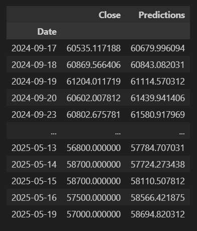

# Phân Tích Kỹ Thuật, Quản Lý Rủi Ro và Dự Đoán Giá Cổ Phiếu Việt Nam Sử Dụng Deep Learning (LSTM)

Dự án này là một bộ công cụ toàn diện được xây dựng bằng Python nhằm mục đích thu thập, xử lý, phân tích chuyên sâu và dự báo biến động giá của các mã cổ phiếu lớn tại thị trường Việt Nam (VN-Index). Dự án tập trung vào 4 mã cổ phiếu đại diện cho các nhóm ngành khác nhau: VCB (Ngân hàng), HPG (Thép), VIC (Bất động sản), và BID (Ngân hàng).

Mục tiêu chính của dự án là cung cấp cái nhìn đa chiều từ phân tích cơ bản, phân tích kỹ thuật, đánh giá rủi ro danh mục đầu tư cho đến việc áp dụng mô hình học sâu (Deep Learning) để dự báo giá tương lai, kết hợp với các yếu tố vĩ mô quốc tế.

## Mục lục

1.  Giới thiệu chung
2.  Quy trình xử lý dữ liệu
3.  Phân tích dữ liệu khám phá (EDA)
4.  Phân tích kỹ thuật (Technical Analysis)
5.  Phân tích tương quan và Mùa vụ
6.  Phân tích rủi ro (Risk Analysis)
7.  Dự báo giá cổ phiếu với LSTM
8.  Công nghệ sử dụng
9.  Hướng dẫn cài đặt và sử dụng

-----

## 1\. Giới thiệu chung

Dự án sử dụng dữ liệu lịch sử từ Yahoo Finance để thực hiện các phân tích định lượng. Hệ thống không chỉ dừng lại ở việc trực quan hóa giá cả mà còn đi sâu vào các chỉ báo kỹ thuật phức tạp, đánh giá hiệu suất danh mục đầu tư và kiểm tra sức chịu đựng rủi ro (Stress Testing).

Điểm nổi bật của dự án là việc triển khai mạng nơ-ron hồi quy LSTM (Long Short-Term Memory) để dự đoán giá đóng cửa, bao gồm cả mô hình đơn biến và mô hình đa biến kết hợp dữ liệu kinh tế vĩ mô (Giá dầu, Vàng, USD Index, S\&P 500, VIX).

## 2\. Quy trình xử lý dữ liệu

Trước khi đi vào phân tích, dữ liệu thô được đưa qua quy trình kiểm tra chất lượng nghiêm ngặt (Data Quality Check):

  * Thu thập dữ liệu: Tự động tải dữ liệu lịch sử của VCB, HPG, VIC, BID.
  * Xử lý giá trị thiếu (Missing Values): Phát hiện và báo cáo các ngày thiếu dữ liệu.
  * Phát hiện điểm ngoại lai (Outliers): Sử dụng phương pháp IQR để xác định các biến động giá bất thường.
  * Kiểm tra sự kiện doanh nghiệp: Phát hiện các đợt chia tách cổ phiếu hoặc trả cổ tức dựa trên biến động giá lớn (\>20%).
  * Kiểm tra ngày nghỉ giao dịch: Đối chiếu với lịch làm việc để xác định ngày lễ.

## 3\. Phân tích dữ liệu khám phá (EDA)

Phần này cung cấp cái nhìn tổng quan về hành vi giá của các mã cổ phiếu:

  * Phân tích xu hướng giá đóng cửa (Closing Price).
  * Tính toán lợi nhuận ngày (Daily Returns) và lợi nhuận tích lũy (Cumulative Returns).
  * So sánh hiệu suất tăng trưởng giữa các mã cổ phiếu.
  * Phân tích phân phối lợi nhuận (Histogram).

## 4\. Phân tích kỹ thuật (Technical Analysis)

Hệ thống tích hợp các chỉ báo kỹ thuật phổ biến và nâng cao để xác định xu hướng thị trường:

  * Chỉ báo xu hướng (Trend): Đường trung bình động (MA10, MA20, MA50), ADX (Average Directional Index) để đo cường độ xu hướng, phát hiện tín hiệu Golden Cross/Death Cross.
  * Chỉ báo động lượng (Momentum): RSI (Relative Strength Index), Stochastic Oscillator, Williams %R.
  * Chỉ báo MACD: Phân tích đường tín hiệu, Histogram và phân kỳ (Divergence).
  * Chỉ báo biến động (Volatility): Bollinger Bands (bao gồm phân tích Squeeze), ATR (Average True Range) để xác định điểm cắt lỗ.
  * Chỉ báo khối lượng (Volume): OBV (On-Balance Volume), VPT (Volume-Price Trend), A/D Line.


## 5\. Phân tích tương quan và Mùa vụ

Dự án thực hiện phân tích thống kê để tìm ra mối liên hệ giữa các tài sản và tính chu kỳ của thị trường:

  * Tương quan chéo (Cross-Asset Correlation): Ma trận tương quan giữa 4 mã cổ phiếu.
  * Tương quan trượt (Rolling Correlation): Theo dõi sự thay đổi mối tương quan theo thời gian (cửa sổ 30 ngày, 60 ngày).
  * Phân tích mùa vụ (Seasonality):
      * Hiệu suất theo tháng trong năm.
      * Hiệu suất theo quý.
      * Hiệu ứng ngày trong tuần (Day-of-Week Effect).
      * Hiệu ứng ngày lễ (Tết Nguyên Đán).

## 6\. Phân tích rủi ro (Risk Analysis)

Đánh giá mức độ rủi ro của từng cổ phiếu và danh mục đầu tư:

  * Độ biến động hàng năm (Annualized Volatility).
  * Rủi ro đuôi (Tail Risk): Tính toán Value at Risk (VaR) và Conditional VaR (CVaR) ở độ tin cậy 95%.
  * Chỉ số đo lường hiệu suất điều chỉnh rủi ro: Sharpe Ratio, Sortino Ratio.
  * Maximum Drawdown: Mức sụt giảm tối đa từ đỉnh xuống đáy.
  * Stress Testing: Mô phỏng hiệu suất danh mục trong các kịch bản thị trường sập hoặc khủng hoảng tài chính.

## 7\. Dự báo giá cổ phiếu với LSTM

Dự án xây dựng và huấn luyện mô hình mạng nơ-ron nhân tạo LSTM để dự đoán giá tương lai.

**Mô hình 1: LSTM Đơn biến**

  * Đầu vào: Chuỗi giá đóng cửa lịch sử.
  * Cấu trúc: 2 lớp LSTM (128 units, 64 units) và các lớp Dense.
  * Đánh giá: Sử dụng RMSE, MAE, MAPE, R-squared.

**Mô hình 2: LSTM Đa biến (Kết hợp dữ liệu Vĩ mô)**

  * Đầu vào: Giá cổ phiếu kết hợp với Giá Dầu (Crude Oil), Vàng (Gold), Chỉ số USD (DXY), S\&P 500, Chỉ số biến động (VIX).
  * Mục tiêu: Cải thiện độ chính xác bằng cách học mối tương quan giữa thị trường chứng khoán Việt Nam và kinh tế thế giới.




## 8\. Công nghệ sử dụng

  * **Ngôn ngữ:** Python 3.x
  * **Thư viện dữ liệu:** Pandas, NumPy, Yfinance
  * **Thư viện trực quan hóa:** Matplotlib, Seaborn
  * **Thư viện thống kê:** Scipy, Statsmodels
  * **Thư viện Machine Learning/Deep Learning:** Scikit-learn, TensorFlow/Keras

## 9\. Hướng dẫn cài đặt và sử dụng

**Yêu cầu hệ thống:**

  * Python 3.8 trở lên.
  * Jupyter Notebook hoặc Google Colab (khuyến nghị).

**Cài đặt các thư viện phụ thuộc:**

Sử dụng pip để cài đặt các thư viện cần thiết:

```bash
pip install pandas numpy matplotlib seaborn scipy statsmodels yfinance scikit-learn tensorflow
```

**Cách chạy dự án:**

1.  Tải mã nguồn về máy.
2.  Mở file `stock.py` hoặc chuyển đổi nội dung sang định dạng `.ipynb` nếu sử dụng Jupyter Notebook.
3.  Chạy tuần tự các khối lệnh (cells).
      * Phần 1 sẽ tải và xử lý dữ liệu, tạo ra các file `.csv` sạch.
      * Các phần tiếp theo sẽ thực hiện phân tích và vẽ biểu đồ.
      * Phần cuối cùng sẽ thực hiện huấn luyện mô hình LSTM. Lưu ý: Quá trình huấn luyện có thể mất thời gian tùy thuộc vào cấu hình phần cứng.

**Lưu ý:**
Dự án cần kết nối internet để tải dữ liệu từ Yahoo Finance. Nếu bạn gặp lỗi khi tải dữ liệu, hãy kiểm tra kết nối mạng hoặc thử lại sau vài phút do giới hạn request của API.